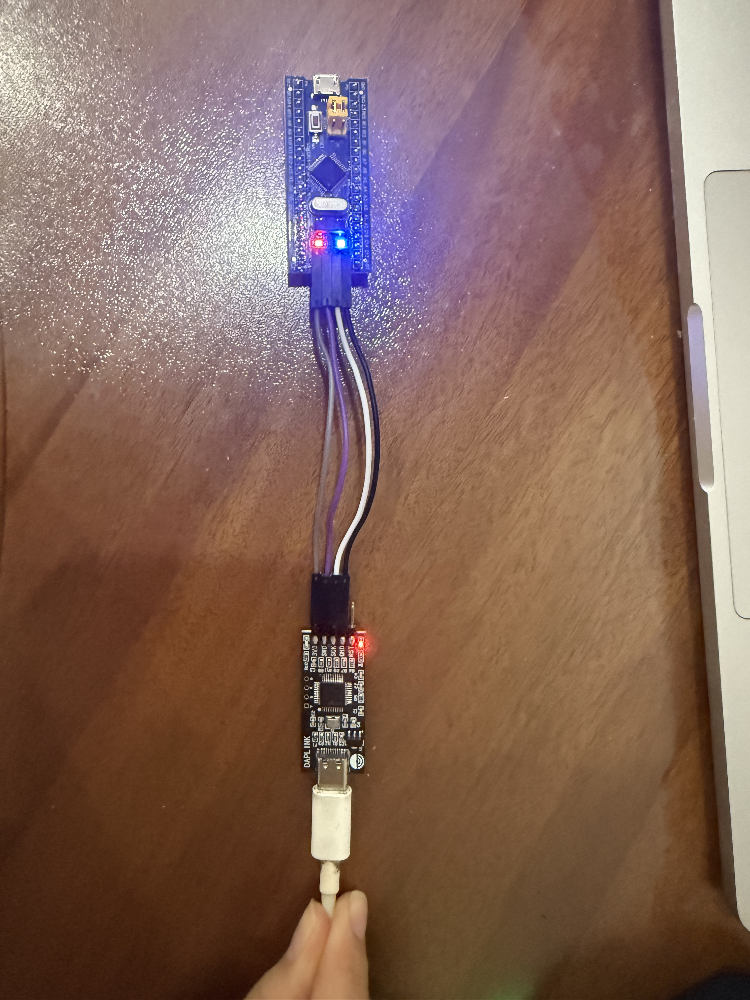
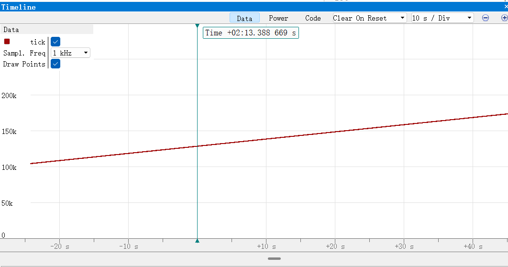
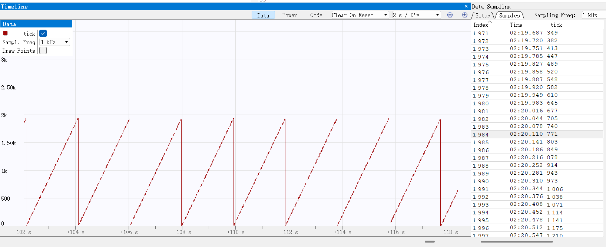

# 电控第一次作业 - STM32F103C8T6

## 一、工程与 GPIO

三题使用同一个 STM32CubeMX CMake 工程，芯片为 STM32F103C8T6。IWDG 从第一题起保持启用。业务逻辑在 `Tasks/src/homework.c`，`main.c` 的 `while (1)` 为空。PC13 配置为推挽输出；在 `Homework_Init()` 中写低电平，使板载 LED 点亮。灯亮照片见附录 1。

## 二、定时器和喂狗

系统时钟使用 8 MHz HSI，AHB 和 APB1 分频均为 1，因此 TIM2 时钟为 8 MHz。设置 PSC = 7、ARR = 999，更新周期为：

```text
(PSC + 1) × (ARR + 1) / TIM2 时钟
= 8 × 1000 / 8,000,000 s
= 0.001 s = 1 ms
```

`Tasks/src/homework.c` 定义全局变量 `volatile uint32_t tick`，TIM2 更新回调每次使它加 1。第二题构建时 `HOMEWORK_FEED_IWDG` 设为 1，回调同时执行 `HAL_IWDG_Refresh(&hiwdg)`：

```c
volatile uint32_t tick = 0;

void HAL_TIM_PeriodElapsedCallback(TIM_HandleTypeDef *htim)
{
  if (htim->Instance == TIM2)
  {
    ++tick;
#if HOMEWORK_FEED_IWDG
    HAL_IWDG_Refresh(&hiwdg);
#endif
  }
}
```

第二题已单独编译并下载 `firmware/02_timer_feed.elf`。附录 2 的 Ozone Timeline 显示 `tick` 持续线性增长，约每秒增加 1000。独立的 pyOCD 采样记录也测得连续 8 秒每秒增加约 1000，截图作为补充记录保存在 `appendix/02_timer_pyocd.png`。

## 三、独立看门狗复位

IWDG 使用分频 64、Reload = 1249。按 STM32F103 的 LSI 约 40 kHz 估算，超时为：

```text
(Reload + 1) × 分频 / LSI
= 1250 × 64 / 40,000 s
= 2 s
```

第三题保持 TIM2 的 1 ms 中断，设 `HOMEWORK_FEED_IWDG` 为 0，编译时排除喂狗调用。已重新编译并单独下载 `firmware/03_watchdog_reset.elf`。附录 3 的 Ozone Timeline 显示 `tick` 约每 2 秒从接近 2000 降到低值，再重新增长，符合 IWDG 周期性复位。独立的 pyOCD 采样也记录到多次回落，截图作为补充记录保存在 `appendix/03_watchdog_pyocd.png`。

## 四、运行截图

附录 1 是板载 LED 点亮照片；附录 2、3 是 Ozone Timeline 的 `tick` 监视截图，分别显示持续计数和周期性回落。`appendix/` 中另外保留 pyOCD 终端采样截图作为补充记录。

## 附录

1. GPIO：板载 LED 点亮照片。  
   

2. 定时器：Ozone Timeline 中 `tick` 约每秒增加 1000。  
   

3. 看门狗：Ozone Timeline 中 `tick` 约每 2 秒回到低值。  
   
