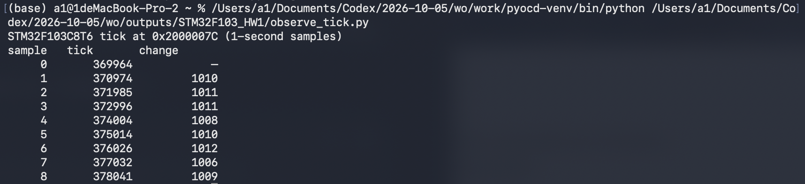
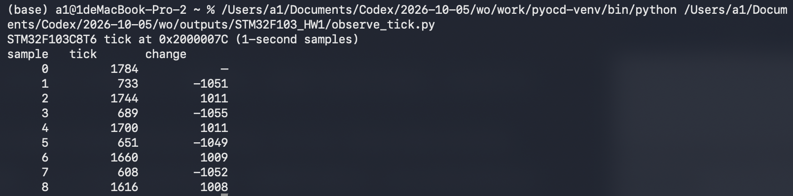

# 电控第一次作业 - STM32F103C8T6

> 状态：硬件运行已验证；第 2、3 题的 Ozone 截图尚未取得。本稿保留 pyOCD 的真实测量截图作为补充证据，不把它们标成 Ozone 截图。

## 一、工程与 GPIO

三题使用同一个 STM32CubeMX CMake 工程，芯片为 STM32F103C8T6。IWDG 从第一题起保持启用。业务逻辑在 `Tasks/src/homework.c`，`main.c` 的 `while (1)` 为空。PC13 配置为推挽输出；在 `Homework_Init()` 中写低电平，使板载 LED 点亮。灯亮照片见附录 1。

## 二、定时器和喂狗

系统时钟使用 8 MHz HSI，AHB 和 APB1 分频均为 1，因此 TIM2 时钟为 8 MHz。设置 PSC = 7、ARR = 999，更新周期为：

```text
(PSC + 1) × (ARR + 1) / TIM2 时钟
= 8 × 1000 / 8,000,000 s
= 0.001 s = 1 ms
```

`Tasks/src/homework.c` 定义全局变量 `volatile uint32_t tick`，TIM2 更新回调每次使它加 1。第二题构建时 `HOMEWORK_FEED_IWDG` 设为 1，回调同时执行 `HAL_IWDG_Refresh(&hiwdg)`：

```c
volatile uint32_t tick = 0;

void HAL_TIM_PeriodElapsedCallback(TIM_HandleTypeDef *htim)
{
  if (htim->Instance == TIM2)
  {
    ++tick;
#if HOMEWORK_FEED_IWDG
    HAL_IWDG_Refresh(&hiwdg);
#endif
  }
}
```

第二题已单独编译并下载 `firmware/02_timer_feed.elf`。pyOCD 每隔约 1 秒读取运行中的 `tick`，测得 369964、370974、371985、372996、374004、375014、376026、377032、378041。连续 8 秒单调增长，采样间增量约为 1000。终端截图见附录 2。

## 三、独立看门狗复位

IWDG 使用分频 64、Reload = 1249。按 STM32F103 的 LSI 约 40 kHz 估算，超时为：

```text
(Reload + 1) × 分频 / LSI
= 1250 × 64 / 40,000 s
= 2 s
```

第三题保持 TIM2 的 1 ms 中断，设 `HOMEWORK_FEED_IWDG` 为 0，编译时排除喂狗调用。已重新编译并单独下载 `firmware/03_watchdog_reset.elf`。pyOCD 测得 `tick` 依次为 1784、733、1744、689、1700、651、1660、608、1616。计数多次从高值降到低值后重新增长，与约 2 秒的周期性复位相符。因为每秒只采样一次，不一定恰好读到复位瞬间的 0。终端截图见附录 3。

## 四、截图要求的当前状态

作业指定第 2、3 题使用 Ozone 的 Watched Data、Timeline 或连续监视截图。现有附录 2、3 是 pyOCD 通过 CMSIS-DAP 对真实板子读取 RAM 的终端截图，仅证明实际运行现象。Ozone 连接时出现许可弹窗，未取得指定截图；提交前仍需补上相应的 Ozone 截图，或向老师说明工具限制并征求是否接受这两张替代截图。

## 附录

1. GPIO：板载 LED 点亮照片。  
   

2. 定时器：pyOCD 实测 `tick` 约每秒增加 1000；待补 Ozone 截图。  
   

3. 看门狗：pyOCD 实测 `tick` 周期性降低；待补 Ozone 截图。  
   
